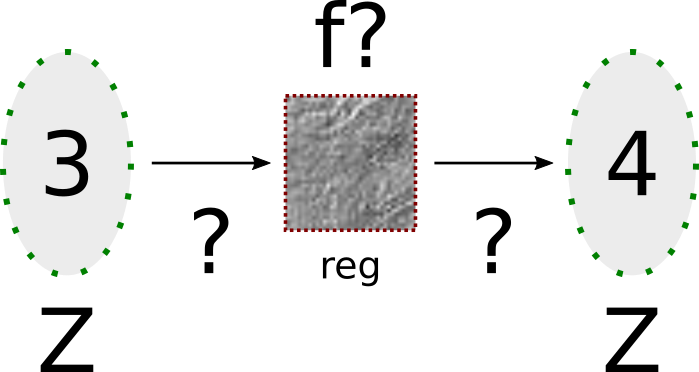
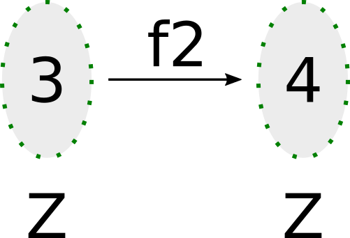

# Tabela de conteúdo

- [Tabela de conteúdo](#tabela-de-conteúdo)
- [Introdução](#introdução)
  - [Efeitos colaterais](#efeitos-colaterais)
  - [Tipos algébricos](#tipos-algébricos)
    - [Soma](#soma)
    - [Produto](#produto)
    - [Uma soma particular: tipos enumerados](#uma-soma-particular-tipos-enumerados)
    - [Um tipo enumerado especial](#um-tipo-enumerado-especial)
  - [Tipos](#tipos)
  - [Tipos compostos](#tipos-compostos)
- [Exercícios](#exercícios)
  - [Exercícios básicos](#exercícios-básicos)
    - [(:star:) nandb](#star-nandb)
    - [(:star:) andb3](#star-andb3)
    - [(:star:) factorial](#star-factorial)
    - [(:star:) ltb](#star-ltb)
    - [(:star:) plus\_id\_exercise](#star-plus_id_exercise)
    - [(:star:) mult\_n\_1](#star-mult_n_1)
    - [(:star::star:) andb\_true\_elim2](#starstar-andb_true_elim2)
    - [(:star:) zero\_nbeq\_plus\_1](#star-zero_nbeq_plus_1)
  - [Exercícios adicionais](#exercícios-adicionais)
    - [(:star:) identity\_fn\_applied\_twice](#star-identity_fn_applied_twice)
    - [(:star:) negation\_fn\_applied\_twice](#star-negation_fn_applied_twice)
    - [(:star::star::star:) andb\_eq\_orb](#starstarstar-andb_eq_orb)
    - [(:star::star::star:) binary](#starstarstar-binary)

# Introdução 

> "Se um procedimento **não possui efeitos colaterais**, então tudo o que precisamos saber sobre ele é como ele [o procedimento] mapeia as entradas às saídas -- isto é, [podemos pensar sobre ele] como um método concreto para computar uma função matemática." (LF, Intro.)

## Efeitos colaterais
  
Considere as duas versões abaixo da mesma função.
  
```c
void f (int *a) {
  *a = *a + 1; /* Se alguma zica acontecer aqui, a função falha. */
  return;
}
```
    
```c
int f2 (int a) {
  return a + 1;
}
```
    
A primeira versão altera o valor registrado pelo ponteiro de *a*, recebido como parâmetro, dentro do escopo de *f*. O resultado de *f* depende do sucesso da alteração do valor registrado pelo ponteiro de *a*. 

|  |
|:--:|
| <b>Com efeito colateral.</b>|

Já *f2*, por sua vez, retorna imediatamente o resultado de $a + 1$. Ao não alterar o input, *f2* mapeia a entrada à saída fiel e previsivelmente. Ela *realmente* só depende do valor que recebe.

|  |
|:--:|
| <b>Sem efeito colateral.</b>|

O primeiro caso é um exemplo de função suscetível a efeito colateral. Em algumas linguagens, como **C**, podemos escolher a nossa abordagem ao sabor da ocasião. Em linguagens puramente funcionais, entretanto, essa escolha não está disponível.
    
> A prevenção a efeitos colaterais é também conhecida como **princípio da imutabilidade do dado**. 
    
Se, por um lado, perdemos em flexibilidade, o que força o programador a se adaptar a uma forma bastante diferente de pensar a programação, por outro, ganhamos em confiabilidade, uma vez que eliminamos ruídos que, em escalas maiores, podem levar a riscos reais ocasionados por graus elevados de imprevisibilidade.
    
Na linguagem do Coq, o único paradigma existente/permitido é o segundo.

> The other sense in which functional programming is "functional" is that it emphasizes the use of functions as **first-class values** -- i.e., values that can be passed as arguments to other functions, returned as results, included in data structures, etc. The recognition that functions can be treated as data gives rise to a host of useful and powerful programming idioms. [(Introduction, SF 1)](https://softwarefoundations.cis.upenn.edu/lf-current/Basics.html)

Dentre as *features* comuns a linguagens funcionais, destacam-se

1. Tipo de dado algébrico;
2. Casamento de padrões (*pattern matching*);
3. Sistemas de tipo polimórfico.

## Tipos algébricos

No Coq, existem duas classes de tipos:

1. Sum types;
2. Product types.
    
São chamados "tipos algébricos" porque são tipos complexos construídos a partir de tipos mais simples previamente existentes, através de procedimentos semelhantes a soma (união disjunta) e produto.

### Soma

> União disjunta. Tipo variante. 

```coq
Inductive string_or_nat := 
| Str : string -> string_or_nat
| Nat : nat -> string_or_nat.

Check Str "Hello World!".
Check Nat 23.
```

Cada valor de string_or_nat *ou* é string *ou* é nat. Não pode ser ambos, por isso o universo dos valores de string_or_nat corresponde a união disjunta do universo dos naturais com o universo das strings. Um tipo variante também é chamado de "união rotulada" (tagged union). Nesse caso, os rótulos são "Str" e "Nat".

### Produto

São tipos compostos da conjunção de outros tipos. É o caso das tuplas. 

Considere o seguinte tipo de par ordenado $nat\_string\_pair : nat \times string$.

```coq
Inductive nat_string_pair :=
| Pair : (nat * string) -> nat_string_pair.

Open Scope string_scope.

Check Pair (2 , "Hello World!").

End Scope string_scope.
```

Os valores do tipo *nat_string_pair* são pares compostos por um natural **e** uma string.

### Uma soma particular: tipos enumerados

Tipos enumerados (*enumerated types*) são tipos de soma em que seus construtores não tomam nenhum argumento: cada construtor define exatamente um valor.

> Como poderíamos capturar o conceito de "dia" (i.e, dia da semana)? Bem... sabemos que um dia da semana ou é segunda, ou é terça, ou é quarta, e assim por diante. Temos, portanto, um conjunto disjunto de possibilidades. Logo, *dia* é um tipo de soma.

```coq
Inductive dia : Type := 
| Segunda
| Terca
| Quarta
| Quinta
| Sexta
| Sabado
| Domingo.

Check Segunda.
Check Domingo.
Check Sexta.
```

> Com base em *dia*, podemos definir funções que operam sobre esse tipo. Por exemplo, "próximo dia útil"é uma função $dia \rightarrow dia$.

```coq
Definition proximo_dia_util 
  (d : dia) : dia :=
  match d with
  | Segunda => Terca
  | Terca => Quarta
  | Quarta => Quinta
  | Quinta => Sexta
  | Sexta => Segunda
  | Sabado => Segunda
  | Domingo => Segunda
  end.
```

> "One point to note is that **the argument and return types of this function are explicitly declared**. Like most functional programming languages, **Coq can often figure out these types for itself** when they are not given explicitly -- i.e., it can do type inference -- but we'll generally include them to make reading easier." (LF)

```coq
Compute proximo_dia_util (proximo_dia_util Quarta).

Example teste_proximo_dia_util :
  (proximo_dia_util (proximo_dia_util terca)) = Quinta.
Proof.
  simpl. reflexivity.
Qed.
```

> "... essentially this can be read as "The assertion we've just made can be proved by observing that both sides of the equality evaluate to the same thing."" (LF)
> > Ambos os lados são "correferenciais" (Alan René).

### Um tipo enumerado especial

Um tipo de dado enumerado, em particular, é um velho conhecido dos lógicos e programadores. Trata-se do tipo bool (em homenagem a George Boole, pai da lógica algébrica), e possui apenas dois construtores: *true* e *false*.

```coq
Inductive bool : Type := true | false.
```

Com base no tipo bool, podemos definir algumas funções.

```coq
Definition negb (b : bool) : bool :=
  match b with
    true => false
  | false => true
  end.

Definition andb (a b : bool) : bool :=
  match a with
    true => b
  | false => false
  end.

Definition orb (a b : bool) : bool :=
  match a with
    true => true
  | false => b
  end.
```

> "(..., Coq does, of course, provide a default implementation of the booleans, together with a multitude of useful functions and lemmas. Whenever possible, we'll name our own definitions and theorems so that they exactly coincide with the ones in the standard library.)" (LF)

> "The last two of these illustrate Coq's syntax for multi-argument function definitions. The corresponding multi-argument application syntax is illustrated by the following "unit tests," which constitute a complete specification -- a truth table -- for the orb function:"

```coq
Example test_orb1: (orb true false) = true.
Proof. simpl. reflexivity. Qed.
Example test_orb2: (orb false false) = false.
Proof. simpl. reflexivity. Qed.
Example test_orb3: (orb false true) = true.
Proof. simpl. reflexivity. Qed.
Example test_orb4: (orb true true) = true.
Proof. simpl. reflexivity. Qed.
```

> "We can also introduce some familiar infix syntax for the boolean operations we have just defined. The Notation command defines a new symbolic notation for an existing definition." (LF)


```coq
Notation "x && y" := (andb x y).
Notation "x || y" := (orb x y).

Example test_orb_notation : false || true || false || false || false = true.
Proof. simpl. reflexivity. Qed.
```

> "These examples are also an opportunity to introduce one more small feature of Coq's programming language: conditional expressions..." (LF)

```coq
Definition negb' (b : bool) : bool :=
  if b then false
  else true.

Definition andb' (a b : bool) : bool :=
  if a then b
  else false.

Definition orb' (a b : bool) : bool :=
  if a then true
  else b.
```

> "Coq's conditionals are exactly like those found in any other language, with one small generalization. Since the bool type is not built in, Coq actually supports conditional expressions over any inductively defined type with exactly two clauses in its definition. The guard is considered true if it evaluates to the "constructor" of the first clause of the Inductive definition (which just happens to be called true in this case) and false if it evaluates to the second." (LF)

```coq
(* Exercício 1 *)

Definition nandb (a b : bool) : bool :=
  match a with
  | false => true 
  | true => negb b
  end.

Example teste_nandb1 : (nandb true false) = true.
Proof. simpl. reflexivity. Qed.
Example teste_nandb2 : (nandb false false) = true.
Proof. simpl. reflexivity. Qed.
Example teste_nandb3 : (nandb false true) = true.
Proof. simpl. reflexivity. Qed.
Example teste_nandb4 : (nandb true true) = false.
Proof. simpl. reflexivity. Qed.

(* Exercício 2 *)

Definition andb3 (a b c : bool) : bool :=
  match a with
  | false => false
  | true => negb (orb (negb b) (negb c))
  end.

Example teste_andb31 : (andb3 true true true) = true.
Proof. simpl. reflexivity. Qed.
Example teste_andb32 : (andb3 false true true) = false.
Proof. simpl. reflexivity. Qed.
Example teste_andb33 : (andb3 true false true) = false.
Proof. simpl. reflexivity. Qed.
Example teste_andb34: (andb3 true true false) = false.
Proof. simpl. reflexivity. Qed.
```

## Tipos

> "Every expression in Coq has a type, describing what sort of thing it computes. The Check command asks Coq to print the type of an expression. (...) If the expression after Check is followed by a colon and a type, Coq will verify that the type of the expression matches the given type and halt with an error if not." (LF)
>

```coq
Check true.
Check (negb true) : bool.
```

## Tipos compostos

Podemos criar novos tipos a partir de tipos já existentes.

> "The types we have defined so far are examples of "enumerated types": their definitions explicitly enumerate a finite set of elements, called constructors. Here is a more interesting type definition, where one of the constructors takes an argument:" (LF)

```coq
Inductive rgb : Type :=
| red
| green
| blue.

Inductive color : Type :=
| black
| white
| primary (p : rgb).
```

> "Let's look at this in a little more detail. An Inductive definition does two things: 
> 1. It defines a set of new constructors. E.g., red, primary, true, false, monday, etc. are constructors.
> 2. It groups them into a new named type, like bool, rgb, or color.
> 
> Constructor expressions are formed by applying a constructor to zero or more other constructors or constructor expressions, obeying the declared number and types of the constructor arguments. E.g.,
> 
> * red
> * true
> * primary red
> * etc.
>
> But not
> * red primary
> * true red
> * primary (primary red)
> * etc.
> 
> In particular, the definitions of rgb and color say which constructor expressions belong to the sets rgb and color:
> 
> * red, green, and blue belong to the set rgb;
> * black and white belong to the set color;
> * if p is a constructor expression belonging to the set rgb, then primary p (pronounced "the constructor primary applied to the argument p") is a constructor expression belonging to the set color; and
> * constructor expressions formed in these ways are the only ones belonging to the sets rgb and color.
>
> We can define functions on colors using pattern matching just as we did for day and bool." (LF)

```coq
Definition monochrome (c : color) : bool :=
  match c with
  | black => true
  | white => true
  | primary p => false
  end.
```

> "Since the primary constructor takes an argument, a pattern matching primary should include either a variable (as above -- note that we can choose its name freely) or a constant of appropriate type (as below)." (LF)

```coq
Definition isred (c : color) : bool :=
  match c with
  | black => false
  | white => false
  | primary red => true
  | primary _ => false
  end.
```

> "The pattern "primary _" here is shorthand for "the constructor primary applied to any rgb constructor except red." (The wildcard pattern _ has the same effect as the dummy pattern variable p in the definition of monochrome.)" (LF)

# Exercícios

Os exercícios a seguir foram extraídos de [Software Foundations, Vol. 1, Cap. 1](https://softwarefoundations.cis.upenn.edu/lf-current/Basics.html).

## Exercícios básicos

### (:star:) nandb

> Remove "Admitted." and complete the definition of the following function; then make sure that the Example assertions below can each be verified by Coq. (...) The function should return true if either or both of its inputs are false.
>>Hint: if simpl will not simplify the goal in your proof, it's probably because you defined nandb without using a match expression. Try a different definition of nandb, or just skip over simpl and go directly to reflexivity. We'll explain this phenomenon later in the chapter.

```coq
Definition nandb (b1:bool) (b2:bool) : bool
  (* REPLACE THIS LINE WITH ":= _your_definition_ ." *). Admitted.

Example test_nandb1: (nandb true false) = true.
(* FILL IN HERE *) Admitted.
Example test_nandb2: (nandb false false) = true.
(* FILL IN HERE *) Admitted.
Example test_nandb3: (nandb false true) = true.
(* FILL IN HERE *) Admitted.
Example test_nandb4: (nandb true true) = false.
(* FILL IN HERE *) Admitted.
```

### (:star:) andb3

> Do the same for the andb3 function below. This function should return true when all of its inputs are true, and false otherwise.

```coq
Definition andb3 (b1:bool) (b2:bool) (b3:bool) : bool
  (* REPLACE THIS LINE WITH ":= _your_definition_ ." *). Admitted.

Example test_andb31: (andb3 true true true) = true.
(* FILL IN HERE *) Admitted.
Example test_andb32: (andb3 false true true) = false.
(* FILL IN HERE *) Admitted.
Example test_andb33: (andb3 true false true) = false.
(* FILL IN HERE *) Admitted.
Example test_andb34: (andb3 true true false) = false.
(* FILL IN HERE *) Admitted.
```

### (:star:) factorial

> Recall the standard mathematical factorial function:
```       
factorial(0)  =  1
factorial(n)  =  n * factorial(n-1)     (if n>0)
```
>Translate this into Coq.
Make sure you put a := between the header we've given you and your definition. If you see an error like "The reference factorial was not found in the current environment," it means you've forgotten the :=.

```coq
Fixpoint factorial (n:nat) : nat
  (* REPLACE THIS LINE WITH ":= _your_definition_ ." *). Admitted.

Example test_factorial1: (factorial 3) = 6.
(* FILL IN HERE *) Admitted.
Example test_factorial2: (factorial 5) = (mult 10 12).
(* FILL IN HERE *) Admitted.
```

### (:star:) ltb

> The ltb function tests natural numbers for less-than, yielding a boolean. Instead of making up a new Fixpoint for this one, define it in terms of a previously defined function. (It can be done with just one previously defined function, but you can use two if you want.)

```coq
Definition ltb (n m : nat) : bool
  (* REPLACE THIS LINE WITH ":= _your_definition_ ." *). Admitted.

Notation "x <? y" := (ltb x y) (at level 70) : nat_scope.

Example test_ltb1: (ltb 2 2) = false.
(* FILL IN HERE *) Admitted.
Example test_ltb2: (ltb 2 4) = true.
(* FILL IN HERE *) Admitted.
Example test_ltb3: (ltb 4 2) = false.
(* FILL IN HERE *) Admitted.
```

### (:star:) plus_id_exercise

> Remove "Admitted." and fill in the proof.

```coq
Theorem plus_id_exercise : forall n m o : nat,
  n = m -> m = o -> n + m = m + o.
Proof.
  (* FILL IN HERE *) Admitted.
```

### (:star:) mult_n_1

> Use those two lemmas about multiplication that we just checked to prove the following theorem. Hint: recall that 1 is S O.

```coq
Theorem mult_n_1 : forall p : nat,
  p * 1 = p.
Proof.
  (* FILL IN HERE *) Admitted.
```

### (:star::star:) andb_true_elim2

> Prove the following claim, marking cases (and subcases) with bullets when you use destruct.
>>Hint: You will eventually need to destruct both Booleans, as in the theorems above. But, delay introducing the hypothesis until after you have an opportunity to simplify it.
>
>>Hint 2: When you reach contradiction in the hypotheses, focus on how to rewrite with that contradiction.

```coq
Theorem andb_true_elim2 : forall b c : bool,
  andb b c = true -> c = true.
Proof.
  (* FILL IN HERE *) Admitted.
```

### (:star:) zero_nbeq_plus_1

```coq
Theorem zero_nbeq_plus_1 : forall n : nat,
  0 =? (n + 1) = false.
Proof.
  (* FILL IN HERE *) Admitted.
```

## Exercícios adicionais

### (:star:) identity_fn_applied_twice

> Use the tactics you have learned so far to prove the following  theorem about boolean functions.

```coq
Theorem identity_fn_applied_twice :
  forall (f : bool -> bool),
  (forall (x : bool), f x = x) ->
  forall (b : bool), f (f b) = b.
Proof.
  (* FILL IN HERE *) Admitted.
```

### (:star:) negation_fn_applied_twice

> Now state and prove a theorem negation_fn_applied_twice similar to the previous one but where the second hypothesis says that the function f has the property that f x = negb x.

```coq
(* FILL IN HERE *)
```

### (:star::star::star:) andb_eq_orb

> Prove the following theorem. (Hint: This one can be a bit tricky, depending on how you approach it. You will probably need both destruct and rewrite, but destructing everything in sight is not the best way.)

```coq
Theorem andb_eq_orb :
  forall (b c : bool),
  (andb b c = orb b c) ->
  b = c.
Proof.
  (* FILL IN HERE *) Admitted.
```
### (:star::star::star:) binary

> We can generalize our unary representation of natural numbers to the more efficient binary representation by treating a binary number as a sequence of constructors B0 and B1 (representing 0s and 1s), terminated by a Z. For comparison, in the unary representation, a number is a sequence of S constructors terminated by an O.
For example:

```
        decimal               binary                          unary
           0                       Z                              O
           1                    B1 Z                            S O
           2                B0 (B1 Z)                        S (S O)
           3                B1 (B1 Z)                     S (S (S O))
           4            B0 (B0 (B1 Z))                 S (S (S (S O)))
           5            B1 (B0 (B1 Z))              S (S (S (S (S O))))
           6            B0 (B1 (B1 Z))           S (S (S (S (S (S O)))))
           7            B1 (B1 (B1 Z))        S (S (S (S (S (S (S O))))))
           8        B0 (B0 (B0 (B1 Z)))    S (S (S (S (S (S (S (S O)))))))
```

> Note that the low-order bit is on the left and the high-order bit is on the right -- the opposite of the way binary numbers are usually written. This choice makes them easier to manipulate.

```coq
Inductive bin : Type :=
  | Z
  | B0 (n : bin)
  | B1 (n : bin).
```

> Complete the definitions below of an increment function incr for binary numbers, and a function bin_to_nat to convert binary numbers to unary numbers.

```coq
Fixpoint incr (m:bin) : bin
  (* REPLACE THIS LINE WITH ":= _your_definition_ ." *). Admitted.
Fixpoint bin_to_nat (m:bin) : nat
  (* REPLACE THIS LINE WITH ":= _your_definition_ ." *). Admitted.
```

> The following "unit tests" of your increment and binary-to-unary functions should pass after you have defined those functions correctly. Of course, unit tests don't fully demonstrate the correctness of your functions! We'll return to that thought at the end of the next chapter.

```coq
Example test_bin_incr1 : (incr (B1 Z)) = B0 (B1 Z).
(* FILL IN HERE *) Admitted.

Example test_bin_incr2 : (incr (B0 (B1 Z))) = B1 (B1 Z).
(* FILL IN HERE *) Admitted.

Example test_bin_incr3 : (incr (B1 (B1 Z))) = B0 (B0 (B1 Z)).
(* FILL IN HERE *) Admitted.

Example test_bin_incr4 : bin_to_nat (B0 (B1 Z)) = 2.
(* FILL IN HERE *) Admitted.

Example test_bin_incr5 :
        bin_to_nat (incr (B1 Z)) = 1 + bin_to_nat (B1 Z).
(* FILL IN HERE *) Admitted.

Example test_bin_incr6 :
        bin_to_nat (incr (incr (B1 Z))) = 2 + bin_to_nat (B1 Z).
(* FILL IN HERE *) Admitted.
```